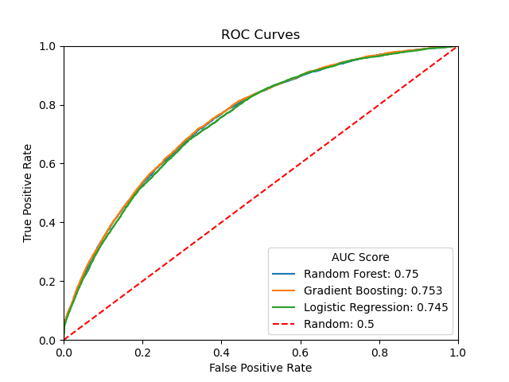

# HockeyxG

Author: Lennon Au-Yeung

This project was created in fulfillment of the blog post requirements for DSCI 542 (Communication and Argumentation), a course in the Master of Data Science program at the University of British Columbia. This project has been further modeified and extended from the original blog post. The link of the blog post can be found [here](https://medium.com/@lennonauyeung/aad521a95819)

## About
Expected goals(xG) have been introduced in recent years in a variety of sports such as soccer and hockey for sports analysts to evaluate how ‘dangerous’ the shot is using data. The main goal of expected goals is to be a statistic that allows us to evaluate the quality of the scoring opportunity. Using the expected goals model, we aim to assign a decimal value to each of the shots between 0 to 1 which represents the likelihood of that shot resulting in a goal, with 0 representing that there is no chance the shot will result in a goal and 1 being the shot will definitely result in a goal.

## Modelling
Three popular expected goals model have been used in this project, including: Logistics Regresison, Gradient Boosting Classifier and Random Forest.

## Results
Using the function from [HarryShomer/xG-Model](https://github.com/HarryShomer/xG-Model), the results was generated below as an ROC curve.

